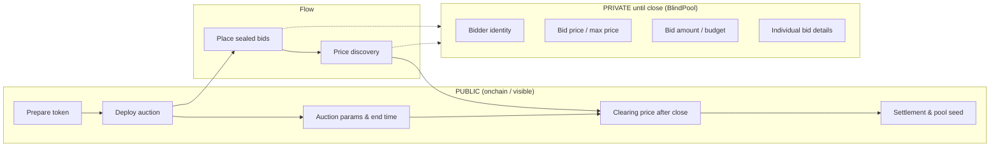

# BlindPool

**Privacy-focused fork of Uniswap's Continuous Clearing Auction (CCA) with sealed-bid configuration.**

Demo video - https://youtu.be/dnrUvJf2Mg4

Pitch - https://blind-pool.vercel.app/ppt

Contract Scripts Repo - https://github.com/ayushsingh82/BlindPool-scripts

## What It Is

[Uniswap's Continuous Clearing Auction (CCA)](https://docs.uniswap.org/) is a mechanism for **fair, continuous price discovery** and **liquidity bootstrapping** for a new token — all onchain and permissionless. Bids are automatically integrated over time to determine a market-clearing price and seed liquidity into a Uniswap pool when the auction ends.

**BlindPool** extends CCA by adding **sealed-bid / confidentiality features**: participants submit bids **privately**, so no one else (including bots or MEV actors) can see bid prices or identities before the auction closes. It resembles sealed-bid auctions in traditional finance, but built for onchain DeFi. Research in confidentiality on blockchains points toward **confidential compute** or **zero-knowledge (ZK)** techniques for this kind of privacy.

## Why It Matters

- **Reduces pre-bid sniping and front-running** — Bids stay hidden until the auction closes.
- **Prevents leakage of strategic bid information** that can be exploited by MEV bots.
- **Brings a more equitable token launch experience** — Fairer access for all participants.

## Risks & Challenges

- **Cryptographic privacy** — Must integrate ZK proofs and/or confidential compute.
- **Onchain enforceability and fairness** — Confidentiality must be verifiable and enforceable onchain.

---

## Workflow

BlindPool follows the same high-level flow as [Uniswap CCA](https://docs.uniswap.org/contracts/liquidity-launchpad/CCA) (prepare → deploy → bid → price discovery → settlement), but **sealed bids** keep participant data private until the auction closes.

### Workflow diagram



**During auction:** Only sealed commitments (e.g. hashes or ZK proofs) are visible onchain. **Bid price**, **bid amount**, and **bidder identity** stay private so MEV and snipers cannot react.

**After close:** Clearing price, total commitment, and settlement become public; liquidity is seeded to Uniswap as in standard CCA.

### Contract reference: what to make private

Relative to the [CCA contract flow](https://docs.uniswap.org/contracts/liquidity-launchpad/CCA) and [technical docs](https://github.com/Uniswap/continuous-clearing-auction):

| CCA concept | Standard CCA | BlindPool (target) |
|-------------|--------------|--------------------|
| **Bidder identity** | Public (msg.sender / address) | **Private** until auction close |
| **Max price per bid** | Public (onchain bid param) | **Private** until close |
| **Budget / bid amount** | Public (onchain bid param) | **Private** until close |
| **Per-bid fill state** | Public (who got how many tokens) | **Private** until close; reveal at settlement |
| **Clearing price (per block / final)** | Public | Public **after** close (can remain hidden during auction) |
| **Total commitment** | Public | Public **after** close |
| **Auction params, end time, token** | Public | Public |
| **Settlement & pool creation** | Public | Public (after close) |

**Implementation direction:** Store only **commitments** (e.g. `commit(bidder, maxPrice, amount)`) or ZK proofs onchain during the auction; reveal or prove against them at settlement so that clearing price and allocations can be computed without leaking individual bids to the public mempool or chain state before close.

---

## Tech Stack

- **Next.js** — App framework
- **Tailwind CSS** — Styling
- **Uniswap CCA** — Base mechanism (forked and extended for privacy)
- **RainbowKit + Wagmi** — Wallet connection (Connect button on auctions)

## Getting Started

```bash
npm install
npm run dev
```

Open [http://localhost:3000](http://localhost:3000) to view the BlindPool app.

**WalletConnect (optional):** For production wallet connect, set `NEXT_PUBLIC_WALLETCONNECT_PROJECT_ID` in `.env.local` with your [WalletConnect Cloud](https://cloud.walletconnect.com/) project ID. The app runs without it; RainbowKit may show a placeholder until set.

## Scripts & Testing

Scripts for deploying BlindPool, CCA auctions, and testing on Sepolia (Foundry):

- **[BlindPool-scripts](https://github.com/ayushsingh82/BlindPool-scripts)** — Deploy CCA, deploy BlindPool, submit bids, reveal, forward, check status. See the repo README for setup and usage.

## Learn More

- [Uniswap CCA Documentation](https://docs.uniswap.org/)
- [CCA Contract & Technical Reference](https://github.com/Uniswap/continuous-clearing-auction)
- [Next.js Documentation](https://nextjs.org/docs)

---

© 2025 BlindPool. Privacy-first CCA. Sealed-bid token launches.
